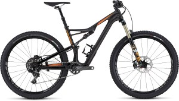

# BICYCLES
Bicycles are divided into a seemingly endless number of categories and sub-categories. The following list will help you understand all the various styles and features.

## MOUNTAIN BIKE
Mountain bikes usually have 26” or 29″ wide knobby tires which allow them to be ridden in loose dirt and over obstacles. These bikes have flat handlebars and rugged frames and components. Mountain bikes often have suspension to help any cyclist navigate rocky mountain trails. Many people ride mountain bikes on roads as well as trails. This does the bike no harm. It could be likened to one driving an SUV on the highway: the vehicle will operate fine–it is simply not the most efficient choice. While mountain-style bikes come in all price ranges, the lower end recreational versions are not suited for aggressive mountain biking but work great for trips on smooth dirt paths.


```markdown
Syntax highlighted code block

# Header 1    
## Header 2
### Header 3

- Bulleted
- List

1. Numbered
2. List

**Bold** and _Italic_ and `Code` text

[Link](url) and 
```

For more details see [GitHub Flavored Markdown](https://guides.github.com/features/mastering-markdown/).

### Hybrid/Comfrot bike
Hybrids and Sport Comfort Bikes share the same comfort features but are distinguished by wheel size. Traditionally, hybrids have a larger road bike sized wheel with a slightly thinner compared to the comfort bikes which yield smaller, mountain style wheels.  Both bikes are loaded with comfort features and will work equally well on smooth dirt, paved trails, and family cycling trips. These bikes have a very upright position meant for comfort.

### Road bike
Road bikes can be identified by their skinny tires and down-turned or “drop” handlebars. These bikes rule the road due to their extreme efficiency and speed. The larger thin tires help it glide along the road with little effort, while the multi-position handlebar offers grip variations from upright to more aggressive. A road bike is the supreme choice for anyone whose intent is  to ride on pavement, especially for longer rides.  It is our great fortune to live in an area with an abundance of great roads for cycling.


### Support or Contact

Having trouble with Pages? Check out our [documentation](https://help.github.com/categories/github-pages-basics/) or [contact support](https://github.com/contact) and we’ll help you sort it out.
